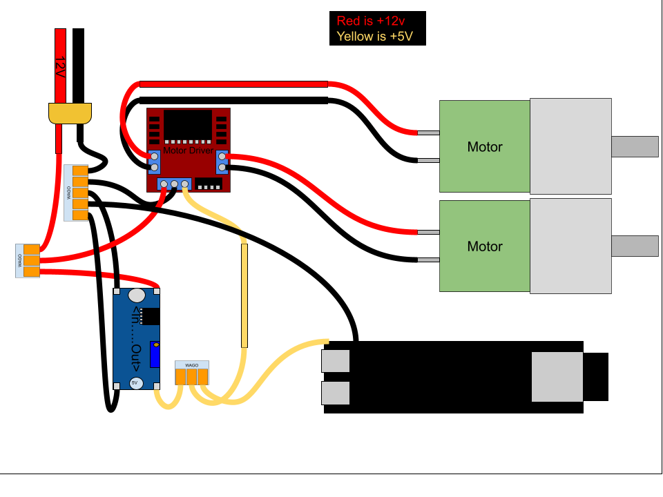

# R6 Surveillance Drone

An open-source recreation of the surveillance drone from Rainbow Six Siege.

## About

I'm building a functional, 3D-printable version of the drone from R6 Siege. It'll have motorized wheels, LEDs, and maybe a camera if I can fit one in there.

Still early days — I've got the motors picked out and a rough CAD design, but there's plenty left to figure out.

The drone was designed to fit on the BambuLab P1S, so it may not be perfectly accurate to the game. If anyone has the correct dimensions and would like to share them, I'm all ears.

I am also *not* and engineer, sorry if it doesnt pan out to work. This is my first project I'm deciding to put time into.

## Progress

- [x] Motor selection
- [x] Initial CAD design
- [x] Finalize parts list
- [x] Electronics/wiring diagram
- [ ] 3D model finalization
- [ ] Assembly guide
- [ ] Software
- [ ] Testing

## Parts List

### Electronics

| Component | Model | Link | Qty |
| --------- | ----- | ---- | --- |
| Battery | 11.1V 3S LiPo 2200mAh | [Amazon](https://www.amazon.com/dp/B07MQT6YJN) | 1 |
| Motors | 12V 550RPM | [Amazon](https://www.amazon.com/dp/B072R5G5GR) | 2 |
| Motor Driver | L298N H-Bridge | [Amazon](https://www.amazon.com/WWZMDiB-L298N-H-Bridge-Controller-Raspberry/dp/B0CR6BX5QL) | 1 |
| MCU | ESP32-S3 Dev Board | [Amazon](https://www.amazon.com/dp/B0C9GLDCRC?th=1) | 1 |
| Buck Converter | LM2596 DC-DC | [Amazon](https://www.amazon.com/dp/B08NV3JCBC) | 1 |
| XT60 Connectors | Male/Female pairs | [Amazon](https://www.amazon.com/dp/B0DB1LBGSH) | 1 pack |
| Power Switch | Rocker switch 10A, 20mm | [Amazon](https://www.amazon.com/dp/B07QQ22DTB) | 1 |
| Blue LEDs | 3mm diffused, 12V pre-wired | [Amazon](https://www.amazon.com/dp/B07T8FN8CS) | 1 pack |
| Resistor Kit | Assortment | [Amazon](https://www.amazon.com/dp/B08FD1XVL6) | 1 pack |
| Wire | 18AWG silicone, multi-color | [Amazon](https://www.amazon.com/dp/B08BR454BX?th=1) | 1 pack |
| Heat Shrink | Assorted tubing kit | [Amazon](https://www.amazon.com/dp/B084GDLSCK) | 1 pack |
| JST Connectors | JST-XH 2.54mm kit | [Amazon](https://www.amazon.com/dp/B0731MZCGF) | 1 pack |
| LiPo Charger | 3S Charger | [Amazon](https://www.amazon.com/dp/B0B5GRRY59) | 1 |
| Camera | Generic Camera Module | [Amazon](www.amazon.com/dp/B012UXNDOY) | 1 |
| Wire Connectors | Lever nuts | [Amazon](https://www.amazon.com/dp/B0CJ5QF3VX) | 1 pack |

### 3D Printed Parts

Individual 3MF files are in `/3mf`. There's also a ready-to-print 3MF in the root folder with all parts pre-positioned and print settings configured.

> **Note:** These parts haven't been tested yet. I'm adding them now for simplicity's sake. If you want to take the leap of faith that everything will work, be my guest!

| Part | Qty | Notes |
| ---- | --- | ----- |
| Main Body Top | 1 | PLA or PETG, 20% infill |
| Main Body Bottom | 1 | PLA or PETG, 20% infill |
| Motor Plates | 2 | 50% infill |
| Wheels | 2 | TPU, 20% infill |

Print at 0.2mm layer height with supports where needed.

## Wiring

**Notes:**

- The blocky wires in the diagram are just for visual clarity.
- This version doesn't include switches or extras — it's purely to verify movement.
- Logic wires aren't shown yet, but I'll add them in a future revision.

## Assembly

1. Print all parts
2. Test fit before committing
3. Install motors to plates
4. Wire up the electronics
5. Test that motors work
6. Attach plates to body
7. Close up the body
8. Final test

Detailed guide coming once I actually build the thing.

## Software

Code coming soon. Planning for:

- Motor control
- LED effects
- Battery monitoring
- WiFi/app control

## Disclaimer

Fan project, not affiliated with Ubisoft. Just for fun.

## License

MIT — see [LICENSE](LICENSE).

---

[github.com/dogwhale65/r6-drone](https://github.com/dogwhale65/r6-drone)
